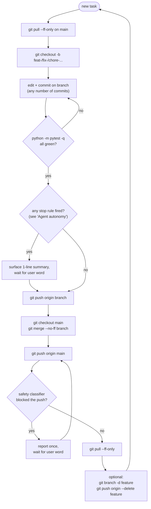

# Workflow

Deterministic git workflow for this repo. Applies to every non-trivial change.
If you (human or agent) think you're about to deviate, stop and re-read.

## The cycle, at a glance



Mental model: the only thing that moves `main` is a `--no-ff` merge from a
green feature branch. Everything else happens on a branch.

## The rule, in seven steps

```
1. git checkout main && git pull --ff-only          # fresh main
2. git checkout -b <feature-branch>                  # off fresh main
3. <edit + commit on the branch, as many commits as needed>
4. python -m pytest -q                               # must pass
5. git push origin <feature-branch>                  # publish the branch
6. git checkout main && git merge --no-ff <feature-branch>
   git push origin main                              # integrate + share
7. git pull --ff-only                                # fresh main again
```

Then loop: step 2 for the next task.

## What the rule means in practice

| Allowed on `main` | NOT allowed on `main` |
|---|---|
| `--no-ff` merge commits | direct work commits |
| `git pull --ff-only` | `git commit -m "<work>"` |
| no edits between merge and next branch creation | `git push --force` |
|  | `git reset --hard` to "fix" main |

The merge into main is always **`--no-ff`** so the feature branch's lineage stays
visible in `git log --first-parent main`. We can read the integration history
by feature, not by individual commits.

## Branch naming

Short kebab-case, prefixed by the work type:

- `feat-<name>` — new functionality
- `fix-<name>` — bug fix
- `chore-<name>` — tooling, deps, ignore rules
- `docs-<name>` — markdown / inline docs
- `config-<name>` — `data/*.yaml`, `.env.example`, etc.
- `refactor-<name>` — restructuring without behaviour change

If a branch covers multiple types, pick the dominant one. A branch that touches
five files for one feature is still `feat-<name>`.

## Tests

`pytest -q` must be green before the push in step 5. If it isn't:

1. Stay on the branch
2. Fix the regression on the branch
3. Re-run the suite
4. Only then proceed to step 5

Never merge a red branch into main. There is no "I'll fix it after the merge."

## Pushing to a remote

- Pushing to `origin/<feature-branch>` is fine at any point after step 5 logic
  is satisfied (tests green).
- Pushing to `origin/main` happens **only** as part of step 6, after a `--no-ff`
  merge from a tested feature branch.
- **Never `git push --force` to `main`** under any circumstance. Never skip
  hooks (`--no-verify`). Never bypass signing.

## Agent autonomy

**Default: the agent runs the full 7-step cycle without asking.** The user
should not have to approve "can I branch?", "can I merge?", or "can I push
main?" on routine work. Those steps are deterministic given a green test run.

The agent **does not pause for approval** when ALL of these hold:

- All tests pass on the branch
- Diff stays within: `src/`, `tests/`, `prompts/`, `data/profile.yaml`,
  `data/config.yaml`, `data/config.example.yaml`, `WORKFLOW.md`,
  `PRD.md`, `.gitignore`, top-level docs
- No file was deleted that contains anyone else's authored content
- No new top-level dependency is being added
- Diff is under ~600 lines total OR the work is a single coherent feature
  the user previously briefed
- Nothing in the diff handles secrets, credentials, or auth tokens

The agent **stops and asks** before merging or pushing main when ANY of these
apply:

- A test is failing or skipped that wasn't skipped before
- The diff touches `pyproject.toml`, `requirements.txt`, `uv.lock`,
  `package.json`, or any other dependency manifest
- The diff adds or modifies anything under `.github/`, `.env*`, or any CI
  config
- The diff modifies the SQLite migration list (`SEEN_JOBS_ADD_COLUMNS` in
  `src/jobbot/state.py`) — schema changes are stop-the-world
- A force-push, history rewrite, or `git reset --hard` would otherwise be
  needed to ship the work
- The user's earlier brief explicitly said "I want to see the result before
  you merge" (one-shot gate; doesn't apply to subsequent unrelated work)
- More than 800 lines of diff cumulative on the branch, regardless of scope

If a stop rule fires, the agent surfaces a one-sentence diff summary, names
the rule that fired, and waits for an in-message authorization word
(`push`, `merge`, `ship`, `go`) before proceeding.

If the auto-mode safety classifier blocks `git push origin main` despite all
the above being satisfied, the agent reports the block once and waits — it
does not retry, work around the classifier, or escalate.

## When the rule has been violated

If commits already exist directly on `main` that should have been on a branch:

1. Don't reset main or do anything destructive yet.
2. Create a feature branch *at the current main tip*:
   `git branch <feature-branch>`
3. Move main back to the last legitimate commit:
   `git branch -f main <last-legit-sha>`
4. The work is preserved on the new branch. Resume the workflow from step 4
   (tests) on that branch.

This is non-destructive: no commits are lost, no working-tree changes are
discarded.

## Cleanup

After a branch has been merged into main and pushed:

```
git branch -d <feature-branch>                   # local
git push origin --delete <feature-branch>        # remote
```

Only delete branches you've confirmed are merged. `git branch --merged main`
lists the safe ones.

## Special cases

- **Hotfix on main**: still a branch (`fix-<name>` off the affected sha), still
  `--no-ff` back into main. The branch may be short-lived but it exists.
- **Doc-only change** (this file, README typos): same workflow. The friction
  is the point — we want one path for everything.
- **Agent-driven work (e.g. Claude Code)**: the agent must follow the same
  seven steps. The agent's memory in
  `~/.claude/projects/.../memory/feedback_branching_strategy.md` mirrors this
  file; if they disagree, this file wins.

## Auto-mode caveat for agents

When an agent is operating in auto mode, pushing to `origin/main` may still
trigger a safety classifier confirmation even if the user approved the push in
a structured question. The agent should treat that block as expected, surface
it once, and wait for an in-message authorization word ("push", "go", "ship")
before retrying. Pushing feature branches is generally unblocked; pushing
`main` is the gated step.
