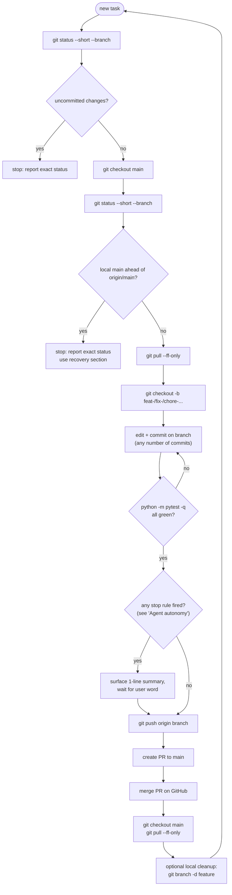

# Workflow

Deterministic git workflow for this repo. Applies to every non-trivial change.
If you (human or agent) think you're about to deviate, stop and re-read.

Claude Code entrypoint: repo-root [CLAUDE.md](CLAUDE.md) points agents here.
That file exists so Claude Code loads these rules automatically when running in
VS Code.

## The cycle, at a glance



Mental model: local `main` only fast-forwards from `origin/main`. Integration
happens on GitHub by merging a tested feature branch PR. Everything else happens
on a branch.

## The rule, in order

```
0. git status --short --branch                       # verify clean state
1. git checkout main && git pull --ff-only           # fresh main
2. git checkout -b <feature-branch>                  # off fresh main
3. <edit + commit on the branch, as many commits as needed>
4. python -m pytest -q                               # must pass
5. git push -u origin <feature-branch>                # publish the branch
6. gh pr create --base main --head <feature-branch> --fill
   gh pr merge --merge --delete-branch                # integrate on GitHub
7. git checkout main && git pull --ff-only            # local main catches up
```

Then loop: step 2 for the next task.

## What the rule means in practice

| Allowed on `main` | NOT allowed on `main` |
|---|---|
| `git pull --ff-only` | direct work commits |
| `git status --short --branch` | local merge commits |
| no edits between pull and next branch creation | `git push origin main` by default |
|  | `git push --force` |
|  | `git reset --hard` to "fix" main |

The merge into main happens on GitHub using a normal merge commit. That keeps the
feature branch's lineage visible in `git log --first-parent main` without
leaving local `main` ahead of `origin/main`.

## Branch naming

Short kebab-case, prefixed by the work type:

- `feat-<name>` — new functionality
- `fix-<name>` — bug fix
- `chore-<name>` — tooling, deps, ignore rules
- `docs-<name>` — markdown / inline docs
- `config-<name>` — `data/*.yaml`, `.env.example`, etc.
- `refactor-<name>` — restructuring without behaviour change

If a branch covers multiple types, pick the dominant one. A branch that touches
five files for one feature is still `feat-<name>`.

## Tests

`pytest -q` must be green before the push in step 5. If it isn't:

1. Stay on the branch
2. Fix the regression on the branch
3. Re-run the suite
4. Only then proceed to step 5

Never integrate a red branch into main. There is no "I'll fix it after the merge."

## Pushing to a remote

- Pushing to `origin/<feature-branch>` is fine at any point after step 5 logic
  is satisfied (tests green).
- Pushing to `origin/main` is **not** part of the default workflow. GitHub moves
  `origin/main` when the PR is merged, then local `main` catches up with
  `git pull --ff-only`.
- A direct `git push origin main` requires explicit user authorization in the
  current conversation.
- **Never `git push --force` to `main`** under any circumstance. Never skip
  hooks (`--no-verify`). Never bypass signing.

## Source Control panel ground truth

VS Code's Source Control panel can lag or show several states next to each
other: uncommitted edits, committed-but-unpushed work, and ahead/behind counts.
Do not infer repository state from that panel alone.

Agents must run `git status --short --branch`:

1. Before starting non-trivial work
2. Before committing
3. After pushing a feature branch
4. After merging a PR and pulling `main`

If the panel looks surprising, report the exact git status and explain which
category the panel is showing: uncommitted changes, outgoing commits, incoming
commits, or stale UI.

## Agent autonomy

**Default: the agent runs the full workflow without asking.** The user
should not have to approve "can I branch?", "can I push the feature branch?", or
"can I create and merge the PR?" on routine work. Those steps are deterministic
given a green test run.

The agent **does not pause for approval** when ALL of these hold:

- All tests pass on the branch
- Diff stays within: `src/`, `tests/`, `prompts/`, `data/profile.yaml`,
  `data/config.yaml`, `data/config.example.yaml`, `WORKFLOW.md`,
  `CLAUDE.md`, `PRD.md`, `.gitignore`, top-level docs
- No file was deleted that contains anyone else's authored content
- No new top-level dependency is being added
- Diff is under ~600 lines total OR the work is a single coherent feature
  the user previously briefed
- Nothing in the diff handles secrets, credentials, or auth tokens

The agent **stops and asks** before merging the PR when ANY of these apply:

- A test is failing or skipped that wasn't skipped before
- The diff touches `pyproject.toml`, `requirements.txt`, `uv.lock`,
  `package.json`, or any other dependency manifest
- The diff adds or modifies anything under `.github/`, `.env*`, or any CI
  config
- The diff modifies the SQLite migration list (`SEEN_JOBS_ADD_COLUMNS` in
  `src/jobbot/state.py`) — schema changes are stop-the-world
- A force-push, history rewrite, or `git reset --hard` would otherwise be
  needed to ship the work
- The user's earlier brief explicitly said "I want to see the result before
  you merge" (one-shot gate; doesn't apply to subsequent unrelated work)
- More than 800 lines of diff cumulative on the branch, regardless of scope

If a stop rule fires, the agent surfaces a one-sentence diff summary, names
the rule that fired, and waits for an in-message authorization word
(`push`, `merge`, `ship`, `go`) before proceeding.

If the PR merge or feature-branch push is blocked by tooling or permissions, the
agent reports the block once and waits. It does not retry blindly, work around
the classifier, or change strategy without user direction.

## If local `main` is ahead of `origin/main`

This should not happen in the default PR-based workflow. It usually means
someone made a local commit or local merge commit on `main`, then did not push
it. VS Code will show this as `Sync Changes N ↑`.

That is **not a steady state**. Do not start new edits while local `main` is
ahead of `origin/main`.

First, identify the state:

```
git status --short --branch
git log --oneline --decorate origin/main..main
```

Common causes:

- Local `main` has a merge commit that was never pushed
- A direct commit landed on `main`
- VS Code is stale and git no longer agrees with the badge

Resolve it with exactly one of:

### Option A - Authorized main push

Use only when the ahead commits are correct and the user explicitly authorizes
publishing them.

```
git push origin main
```

On success, run:

```
git pull --ff-only
```

### Option B - Preserve work on a branch and recover main

Use when the ahead work should be reviewed through the normal PR path instead of
being pushed directly to `main`.

```
git branch <recovery-branch>
git checkout <recovery-branch>
git branch -f main origin/main
git checkout main
git pull --ff-only
git checkout <recovery-branch>
git push -u origin <recovery-branch>
gh pr create --base main --head <recovery-branch> --fill
```

This is non-destructive because the ahead commits are preserved on
`<recovery-branch>` before `main` is moved back to `origin/main`. If there is any
uncertainty about the ahead commits, stop and ask before moving `main`.

### What NOT to do

- Don't `git reset --hard origin/main` to "clear" the divergence — that
  silently discards the local merge commit. The work survives on the feature
  branch, but the integration was lost.
- Don't `git push --force` to main. Ever.
- Don't sit on main with unpushed commits and start new edits — accidental
  commits will land on main. If you have to pause, `git checkout <branch>`
  off main immediately.

## After the cycle: don't linger on main

Once the PR is merged and `git pull --ff-only` returns "Already up to date",
create the next feature branch right away if more work is queued:

```
git checkout -b <next-feature-branch>
```

The agent does this automatically as part of starting the next task. The
purpose is to make commits on `main` impossible — if HEAD is never on main,
no message in the commit box can accidentally write there.

## When the rule has been violated

If commits already exist directly on `main` that should have been on a branch:

1. Don't reset main or do anything destructive yet.
2. Create a feature branch *at the current main tip*:
   `git branch <feature-branch>`
3. Check out the feature branch:
   `git checkout <feature-branch>`
4. Move main back to the last legitimate commit:
   `git branch -f main <last-legit-sha>`
5. The work is preserved on the new branch. Resume the workflow from step 4
   (tests) on that branch.

This is non-destructive: no commits are lost, no working-tree changes are
discarded.

## Cleanup

After a branch has been merged into main through GitHub:

```
git branch -d <feature-branch>                   # local
git push origin --delete <feature-branch>        # remote, only if PR merge did not delete it
```

Only delete branches you've confirmed are merged. `git branch --merged main`
lists the safe ones.

## Special cases

- **Hotfix on main**: still a branch (`fix-<name>` off the affected sha), still
  merged back through GitHub PR. The branch may be short-lived but it exists.
- **Doc-only change** (this file, README typos): same workflow. The friction
  is the point — we want one path for everything.
- **Agent-driven work (e.g. Claude Code in VS Code)**: the agent must follow the
  same ordered workflow. Repo-root `CLAUDE.md` exists to make Claude Code load this
  workflow. If Claude memory, chat instructions, and this file disagree, this
  file wins for repo git policy.

## Local-main push fallback

`git push origin main` is a fallback, not the default route. Use it only when the
user explicitly chooses to publish local `main` directly. If a safety classifier
or permission layer blocks that push, the agent reports the block once and waits
for an in-message authorization word ("push", "go", "ship") before retrying.
