# Claude Code Handoff

This project is being split into implementation and QA responsibilities:

- Claude Code owns product implementation.
- Codex owns test-suite design, acceptance criteria, and regression contracts.

Treat failing Codex-authored tests as product requirements unless the test is explicitly reviewed and found to describe the wrong user journey. The goal is not to make tests pass by weakening them. The goal is to make the application behavior match the journeys below.

## User Journey Map

```mermaid
flowchart LR
  subgraph J1["1. Run And Observe"]
    direction TB
    A1["User starts or schedules the pipeline"]
    A2["Dashboard shows an active run"]
    A3["Scrape progress updates live"]
    A4{{"Acceptance: user can tell work is currently happening"}}
    A5["Failure: dashboard looks idle while scraper runs"]
    A1 --> A2 --> A3 --> A4
    A2 --> A5
  end

  subgraph J2["2. Scrape Quality"]
    direction TB
    B1["User opens Stage 1"]
    B2["Sees hits per portal"]
    B3["Sees last run timestamp and duration"]
    B4["Sees description coverage per portal"]
    B5{{"Acceptance: weak portals and missing descriptions are visible"}}
    B6["Failure: counts exist but body quality is hidden"]
    B1 --> B2 --> B3 --> B4 --> B5
    B2 --> B6
  end

  subgraph J3["3. Backfill And Rescore"]
    direction TB
    C1["User runs enrich --backfill"]
    C2["Missing descriptions are fetched"]
    C3["User runs rescore --backfill or rescore --base"]
    C4["Scores reflect full body text or tailored docs"]
    C5{{"Acceptance: stale/base-only scores are not shown as tailored scores"}}
    C6["Failure: old base score appears as final tailored result"]
    C1 --> C2 --> C3 --> C4 --> C5
    C3 --> C6
  end

  subgraph J4["4. Stage 2 Triage"]
    direction TB
    D1["User opens PO/PM shortlist"]
    D2["User sorts by score, portal, apply channel, description, salary, seniority"]
    D3["User sees apply route per job"]
    D4["User sees description available yes/no"]
    D5{{"Acceptance: user can prioritize jobs without opening every row"}}
    D6["Failure: important triage fields are absent or unsortable"]
    D1 --> D2 --> D3 --> D4 --> D5
    D2 --> D6
  end

  subgraph J5["5. Tailored Decision"]
    direction TB
    E1["User opens Stage 3"]
    E2["User sees tailored CV and cover letter availability"]
    E3["User sees base score to tailored score delta"]
    E4["User sees pending state when tailored rescore has not run"]
    E5{{"Acceptance: user knows whether tailored score is real"}}
    E6["Failure: generated docs exist but tailored rescore status is ambiguous"]
    E1 --> E2 --> E3 --> E4 --> E5
    E2 --> E6
  end

  subgraph J6["6. Export And Audit"]
    direction TB
    F1["User clicks Export JSON"]
    F2["Dashboard writes export to Downloads"]
    F3["Repo data directory stays clean"]
    F4{{"Acceptance: export is usable and does not pollute repo state"}}
    F5["Failure: export disappears, writes to repo, or gives no status"]
    F1 --> F2 --> F3 --> F4
    F1 --> F5
  end

  subgraph J7["7. Apply And Outcomes"]
    direction TB
    G1["User queues or submits applications"]
    G2["System records submitted, failed, or needs-review state"]
    G3["Inbox scan detects replies, bounces, confirmations, rejections, interviews"]
    G4["Dashboard shows outcome status"]
    G5{{"Acceptance: user sees what happened after applying"}}
    G6["Failure: applications vanish after submit"]
    G1 --> G2 --> G3 --> G4 --> G5
    G2 --> G6
  end

  J1 --> J2 --> J3 --> J4 --> J5 --> J6 --> J7
```

## Implementation Priorities

1. Dashboard panels must be visibly collapsible and expandable. Each panel header needs a chevron, keyboard access, correct `aria-expanded`, and content that returns intact after expanding.

2. Live pipeline progress must be visible in the dashboard while scrape or enrichment work is active. A user should not need terminal logs to know whether the run is progressing.

3. Stage 1 must show latest run timestamp, run duration, hits per portal, and description coverage.

4. Stage 2 must expose the PO/PM triage fields a user actually needs: score, title, portal, apply channel, description available/scraped yes/no, salary, and seniority. Decision columns should be sortable where useful.

5. Stage 3 must never present an old base-CV score as if it were a tailored rescore. If generated docs exist but tailored rescoring has not run, show an explicit pending state.

6. Export JSON must write to `~/Downloads/jobs_export_<timestamp>.json`, not repo-local data folders. The dashboard should show success and failure feedback.

7. README-advertised apply and inbox flows must match actual CLI/dashboard behavior. If scheduled commands are documented, the CLI should register them or tests should expose that gap.

## Test Discipline

When a test fails:

1. Check whether the test describes one of the journeys above.
2. If it does, fix the implementation.
3. If the journey changed, update this handoff and then update the test.
4. Do not remove assertions just to make the suite green.
5. Do not replace end-to-end product checks with mocks that hide the user-visible failure.

Codex may add failing tests for missing behavior. Those failures are intentional product signals unless marked otherwise in the test reason or handoff.
